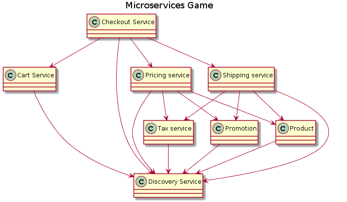

# Description

In this lab we will explore Test Driven Development (TDD) techniques by creating a microservice using Node.js.
The base for this service is the `Shipping Service` from the "microservices game":

